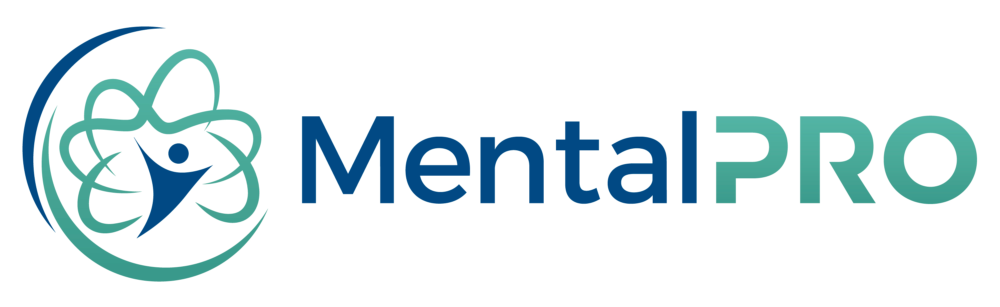
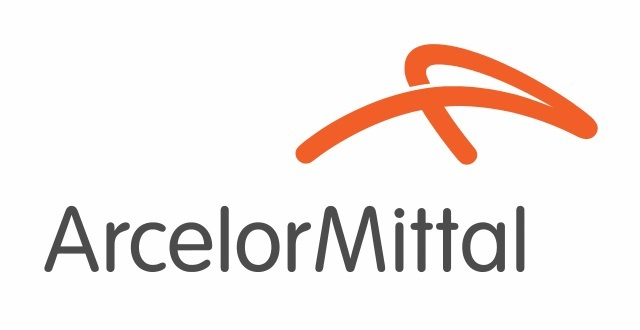
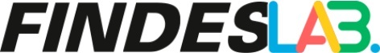

# Sobre mim

Fico feliz se chegou aqui!

Sou Juan Novais, desenvolvedor de software, apaixonado por tecnologia. Atualmente tenho 1 ano de experiência profissional como desenvolvedor, onde atuei no [Instituto Senai de Tecnologia e Inovação](https://senaies.com.br/isteo/)

No IST, os projetos são selecionados por editais, absorvendo principalmente projetos de relevância para a sociedade, e ou indústria.

Onde tive a oportunidade de atuar diretamente desenvolvendo API's e sistemas para empresas como: 

## Projetos Destacados

### Marca Ambiental

  

Breve descrição do projeto e seu propósito. Destaque as tecnologias utilizadas, os desafios enfrentados e suas contribuições específicas.

### MentalPRO

  

Breve descrição do projeto e sua finalidade. Mencione as tecnologias utilizadas, o papel que desempenhou no projeto e quaisquer resultados ou conquistas relevantes.

### Arcelor Mittal

  

Descreva o projeto, seu contexto e objetivo. Destaque suas responsabilidades e realizações específicas, bem como as tecnologias empregadas.

### Wikki

  

Breve descrição do projeto e seu propósito. Destaque as tecnologias utilizadas, os desafios enfrentados e suas contribuições específicas.

### FindesLAB

  

Breve descrição do projeto e sua finalidade. Mencione as tecnologias utilizadas, o papel que desempenhou no projeto e quaisquer resultados ou conquistas relevantes.

## Contato

Se você deseja saber mais sobre mim ou tiver alguma oportunidade interessante para discutir, fique à vontade para entrar em contato. Estou aberto a colaborações, novos projetos e desafios emocionantes.

- E-mail: [seu e-mail]
- LinkedIn: [seu perfil no LinkedIn]
- Website/portfolio: [seu website ou portfólio, se tiver]
