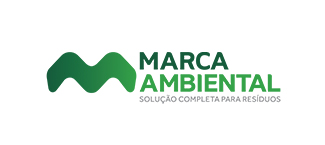
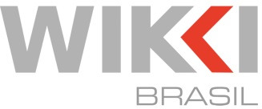

  
# Sobre mim
  

 

Olá! Fico feliz se chegou aqui!

Sou Juan Novais, tenho 22 anos, sou desenvolvedor de software e entusiasta de tecnologia.

Atualmente tenho 1 ano de experiência profissional como desenvolvedor, onde atuei no [Instituto Senai de Tecnologia e Inovação](https://senaies.com.br/isteo/).

No IST, os projetos são selecionados por editais, absorvendo principalmente projetos de relevância para a sociedade, e ou indústria.

Onde tive a oportunidade de atuar diretamente desenvolvendo API's e sistemas para empresas e projetos como: 

 

 

  
## Mãos que conectam com a segurança

   
 Esse foi meu primeiro projeto profissional, de nível não tão alto de complexidade, mas que me ensinou os conceitos chave de API, segurança, escalabilidade, e que mais tarde, tive até que fazer deploy utilizando Azure Functions. 

Desenvolvido em TypeScript, utilizando Node.js, Express, Prisma.IO e MySQL, o "Mãos que conectam com a segurança", consiste em um sistema interno da empresa, para instruir os funcionários sobre segurança do trabalho. Temos áreas, como "Portaria", ou "Tratamento térmico de resíduos", onde temos vídeos explicativos para os funcionários dessas áreas.

Junto com o sistema, a equipe de design do IST, desenvolveu vídeos, e uma personagem, a "Norminha". 
  

  
[Clique aqui para assistir um vídeo dela!](https://www.youtube.com/watch?v=HD5J8MheS58) 
[Link de entrega do projeto](https://www.linkedin.com/posts/regiane-giacomin-74574a189_design-treinamento-tecnologia-activity-7032508165032181760-QVwO?utm_source=share&utm_medium=member_desktop)
  

 

## Mental PRO

  
[A Mental PRO](https://mentalpro.org) é uma startup que busca a solução completa de saúde mental para organizações utilizando dados. 

A startup possui diversos serviços, o produto que eu participei do desenvolvimento foi o [Diagnóstico Mental PRO de Saúde Mental Organizacional](https://mentalpro.org/diagnostico-mental-pro-de-saude-mental-organizacional/)

Utilizando JavaScript, Node.js, Express, Sequelize e MySQL, contribuí muito ativamente da construção da API para o sistema, uma aplicação muito complexa, com diversas funcionalidades e requisitos. Esse, com certeza, é o projeto que mais aprendi e me desenvolvi. 

Passando por etapas como: Utilizar Nodemailer e cron para rotinas de notificações;

Alterar toda a autenticação e criptografia do sistema, devido a novas requisições no processo de desenvolvimento;

Por ser um produto voltado a organizações, desenvolvi uma função de cadastro via CSV, para registrar todos os funcionários, a partir de uma planilha de Excel, por exemplo;

Documentação da API utilizando Swagger; 

  

 

## Arcelor Mittal / Wikki

Nessa parceria entre [Arcelor Mittal](https://brasil.arcelormittal.com) e [Wikki](https://www.wikki.com.br), o IST assumiu o projeto de desenvolver um front-end em React Native para uma API de cálculos geométricos e estatísticos, já existente, para chapas de aço industriais.

Minha atuação nesse projeto foi principalmente realizando a integração da API com o frontend, Utilizando [Axios](https://axios-http.com/docs/intro). 

Realizei tratamentos e validação dos dados; 

Armazenei utilizando Local Storage;

Realizei algumas lógicas em funções para o Frontend; 

Além de realizar efetivamente a conexão com os endpoints, estudei bastante a documentação da API da Wikki. 

  
  

 

## FindesLAB

  Durante meu tempo de curso técnico e estágio, com o sistema SENAI, tive muito contato com o [FindesLAB](findeslab.com.br), que é um Hub para que startups, empresas e indústrias, possam se conectar e trazer soluções inovadoras. 

  
  

 

## Contato

Se você deseja saber mais sobre mim ou tiver alguma oportunidade interessante para discutir, fique à vontade para entrar em contato. Estou aberto a colaborações, novos projetos e desafios emocionantes.

  
- E-mail: juannovais@gmail.com
  
- [LinkedIn](https://www.linkedin.com/in/juan-novais/)

